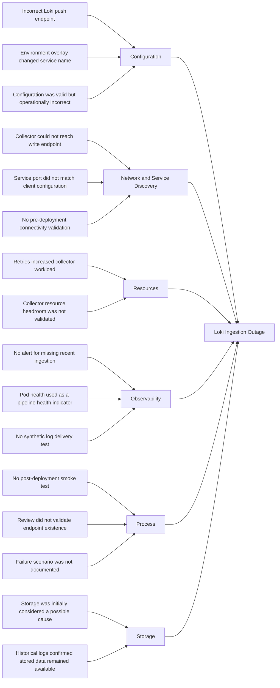

# Case Study 1: Loki Ingestion Outage

## Incident Summary

| Field | Detail |
|---|---|
| Incident | Loki Ingestion Outage |
| Environment | Workhorse development environment |
| Affected component | Loki log ingestion pipeline |
| User impact | Recent application logs were unavailable in Grafana |
| Detection method | Missing log streams and ingestion-related alerts |
| Severity | Warning |
| Data impact | Logs produced during the incident may not have been indexed |
| Resolution | Corrected the Loki ingestion endpoint and validated end-to-end log delivery |

---

## System Context

The Workhorse observability stack uses the following path to collect and query application logs:

```text
Application Pods
      |
      v
Alloy (Log Collector)
      |
      v
Loki
      |
      v
Filesystem Storage
      |
      v
Grafana
```

A failure involving the log collector (Alloy), Loki, storage backend, or network path can interrupt log ingestion.

---

## Symptoms

The incident presented the following symptoms:

- Grafana queries returned no recent application logs.
- Historical logs remained queryable.
- New log entries stopped appearing for the `emojivoto-*` namespaces.
- Log collector pods reported retries or failed batch submissions.
- Loki components reported an increased number of ingestion errors.
- Application pods remained healthy and continued serving traffic.
- Prometheus metrics remain available.
- Grafana remained accessible, but Loki queries returned incomplete or empty results.
- No application outage was detected outside the logging pipeline.

### Example User-Facing Symptom

```text
No logs found for the selected time range.
```

### Initial Pod Checks

```bash
kubectl get pods -n monitoring
kubectl get pods -n monitoring -l app.kubernetes.io/name=loki
kubectl get pods -n monitoring -l app.kubernetes.io/name=alloy
```

Potential unhealthy states included:

```text
CrashLoopBackOff
Error
Pending
Running with repeated restarts
```

---

## Investigation

### 1. Confirm the Scope

The first step was to determine whether the outage affected:

- A single application
- A single namespace
- One log collector instance
- One Loki component
- All workloads in the cluster
- Only log ingestion
- Both ingestion and querying

Cluster health and recent events were reviewed:

```bash
kubectl get pods -A
kubectl get events -A --sort-by=.metadata.creationTimestamp
```

Several LogQL queries were tested in Grafana:

```logql
{namespace=~"emojivoto-.*"}
```

```logql
{namespace="monitoring"}
```

Historical logs were available, but newly generated logs were missing.

This indicated an ingestion problem rather than a complete Loki storage or Grafana query failure.

---

### 2. Generate a Known Test Log

A deterministic test log was generated:

```bash
kubectl run loki-ingestion-test \
  --image=busybox:1.36 \
  --restart=Never \
  -n emojivoto-dev \
  -- /bin/sh -c 'echo "WORKHORSE_LOKI_INGESTION_TEST"; sleep 30'
```

The test message was then queried in Grafana:

```logql
{namespace="emojivoto-dev"} |= "WORKHORSE_LOKI_INGESTION_TEST"
```

The test message did not appear.

This confirmed that the ingestion problem could be reproduced independently of the application.

---

### 3. Verify Log Collector (Alloy) Health

The Alloy DaemonSet and its pods were inspected:

```bash
kubectl get daemonsets -n monitoring
kubectl get pods -n monitoring -o wide
kubectl describe pod <alloy-pod> -n monitoring
kubectl logs <alloy-pod> -n monitoring --since=30m
```

The Alloy logs were checked for:

- HTTP 429 responses
- HTTP 500 responses
- Connection refusals
- DNS resolution failures
- Authentication failures
- Request timeouts
- Batch retry messages
- Permission errors
- Rejected log entries
- Incorrect push endpoints

Example failure messages included:

```text
error sending batch
server returned HTTP status 500
retrying request to Loki
```

---

### 4. Validate Service Discovery

Loki services and endpoints were reviewed:

```bash
kubectl get svc -n monitoring
kubectl get endpointslices -n monitoring
```

The collector push URL was compared with the active Loki service:

```text
http://loki.monitoring.svc.cluster.local/loki/api/v1/push
```

DNS resolution was tested from inside the cluster:

```bash
kubectl run dns-test -it \
  --image=busybox:1.36 \
  --restart=Never \
  -n monitoring \
  -- nslookup loki.monitoring.svc.cluster.local
```

This test determined whether the collector could resolve the configured Loki service.

---

### 5. Test Network Connectivity

Connectivity to the Loki endpoint was tested from a temporary pod:

```bash
kubectl run curl-test -it \
  --image=curlimages/curl \
  --restart=Never \
  -n monitoring \
  -- curl -sv http://loki.monitoring.svc.cluster.local:3100/ready
```

This test helped identify:

- DNS failures
- Incorrect service ports
- Missing service endpoints
- NetworkPolicy restrictions
- Loki readiness failures

---

### 6. Inspect Loki Components

The individual Loki workloads were reviewed:

```bash
kubectl get pods -n monitoring -l app.kubernetes.io/name=loki
kubectl logs <loki-pod> -n monitoring --since=30m
kubectl describe pod <loki-pod> -n monitoring
```

The investigation checked for:

- Storage write failures
- Ingester unavailability
- Resource exhaustion
- Repeated pod restarts
- Object storage errors
- Rejected writes
- Configuration parsing errors

---

### 7. Review Recent Git Repo Changes

Compare the deployed configuration with the last known-good Git revision.

Nagivate to https://github.com/jresmith/workhorse-aws-terraform/commits/main/ to review repo commit history and compare last known good commit with current commit.

The review focused on changes to:

- Loki service names
- Loki service ports
- Collector push URLs
- Helm values
- Storage configuration
- Resource requests and limits
- NetworkPolicy resources
- Authentication settings
- Kustomize patches
- Environment-specific overlays

The live resources were also inspected:

```bash
kubectl get configmap -n monitoring
kubectl get deployment -n monitoring -o yaml
kubectl get statefulset -n monitoring -o yaml
```

---

### 8. Correlate Metrics With the Failure

Prometheus metrics were used to establish the incident timeline and determine whether Loki was receiving requests but failing to process them.

Relevant signals included:

- Loki ingestion request rate
- Failed ingestion requests
- Rejected log lines
- Distributor errors
- Ingester availability
- Loki pod restarts
- Collector retry rate
- Container memory usage
- Storage request failures

Prometheus provided an independent source of evidence while the centralized logging pipeline was unavailable.

---

## Root Cause Analysis

### Root Cause Statement

A Git repo configuration change introduced an incorrect Loki ingestion endpoint in the development environment overlay.

The MR looked like:

```bash
loki.write "default" {
  endpoint {
-   url = "http://loki-gateway.monitoring.svc.cluster.local/loki/api/v1/push"
+   url = "http://loki.monitoring.svc.cluster.local/loki/api/v1/push"
  }
}
```

The log collectors continued reading container logs from the Kubernetes nodes, but they could not successfully deliver log batches to the active Loki write endpoint.

The configuration was syntactically valid, so Kubernetes accepted the deployment. However, the configured service name or port did not correspond to the active Loki write service.

The collectors retried the failed requests, but the monitoring configuration did not provide an early warning that successful ingestion had stopped.

As a result, Grafana displayed historical logs while new log entries were absent.

---

### Contributing Factors

- The collector configuration was syntactically valid.
- The deployment completed despite the endpoint being operationally incorrect.
- The configured service name or port did not match the active Loki write endpoint.
- No automated smoke test validated log delivery after deployment.
- Monitoring checked pod health but not successful data ingestion.
- Grafana availability was treated as an indirect indication of logging health.
- No synthetic log canary verified end-to-end ingestion.
- Environment-specific Loki endpoints were not validated in CI.
- The troubleshooting runbook did not include endpoint validation.

---

### Ishikawa Fishbone Diagram



---

### Five Whys

1. **Why were new logs unavailable in Grafana?**

   Loki was not successfully ingesting new log batches.

2. **Why was Loki not ingesting the batches?**

   The collectors were sending data to an incorrect or unavailable write endpoint.

3. **Why were the collectors using the incorrect endpoint?**

   An environment-specific GitOps configuration changed the Loki service name or port.

4. **Why was the configuration deployed successfully?**

   The configuration was structurally valid, and deployment validation only checked whether the Kubernetes resources became healthy.

5. **Why was the outage not detected immediately?**

   Monitoring checked component availability but did not verify end-to-end log ingestion.

---

## Fix

### Immediate Remediation

The Loki client configuration was corrected so that it referenced the active in-cluster write endpoint.

Example configuration:

```yaml
clients:
  - url: http://loki-gateway.monitoring.svc.cluster.local/loki/api/v1/push
```

> Important: The service name and port must be taken from the Loki services deployed in Workhorse. The example above should not be copied without validating the active Loki deployment topology.

The active service and endpoint were verified:

```bash
kubectl get svc -n monitoring
kubectl get endpoints -n monitoring
```

The corrected configuration was:

1. Added to the appropriate environment overlay.
2. Committed to the Workhorse repository.
3. Reviewed through a pull request.
4. Reconciled by the GitOps controller.
5. Verified against the live cluster.

The log collector pods were then reconciled so that they loaded the corrected configuration.

---

### Recovery Validation

A second deterministic log entry was generated:

```bash
kubectl run loki-recovery-test \
  --image=busybox:1.36 \
  --restart=Never \
  -n emojivoto-dev \
  -- /bin/sh -c 'echo "WORKHORSE_LOKI_RECOVERY_CONFIRMED"; sleep 30'
```

The recovery message was queried in Grafana:

```logql
{namespace="emojivoto-dev"} |= "WORKHORSE_LOKI_RECOVERY_CONFIRMED"
```

Recovery was confirmed when:

- The synthetic test log appeared in Loki.
- Recent application logs became queryable.
- Collector retry errors stopped.
- Loki ingestion errors returned to normal.
- Loki pods remained ready.
- Historical logs remained accessible.
- Prometheus metrics and alerts remained available.
- The deployed configuration matched the Git repository.

---

### Rollback Strategy

If the corrected configuration had not restored ingestion, the change could be reverted to a previous commit.

The GitOps controller would then reconcile the last known-good configuration without requiring an undocumented manual cluster change.

---

## Preventions

### Configuration Controls

- Define Loki endpoints in the common 'base' where possible.
- Limit environment overlays to settings that genuinely differ.
- Validate that referenced services and ports exist.
- Use schema validation for Helm values and rendered manifests.
- Review rendered Kustomize output before merging.
- Prevent direct configuration changes in the cluster.
- Manage all permanent remediation through GitOps.

---

### Automated Validation

Render and validate the final development configuration during CI:

```bash
kubectl kustomize --enable-helm kubernetes/overlays/dev
```

Add a post-deployment smoke test that:

1. Generates a uniquely identifiable log entry.
2. Queries Loki for the entry.
3. Fails if the entry does not appear within the permitted validation window.
4. Records the result as deployment evidence.

---

### Monitoring Improvements

Create alerts for:

- Sustained Loki ingestion request failures
- Rejected log entries
- Elevated collector retry rates
- Loki component unavailability
- Repeated Loki pod restarts
- Storage write failures
- Unexpected absence of incoming log entries
- Synthetic log canary failures

Example alert structure:

```yaml
- alert: LokiIngestionErrors
  expr: |
    sum(
      rate(loki_request_duration_seconds_count{
        status_code=~"5.."
      }[5m])
    ) > 0
  for: 10m
  labels:
    severity: warning
    alert_category: observability
  annotations:
    summary: "Loki is returning ingestion errors"
    description: "Loki has returned ingestion-related server errors continuously for 10 minutes."
```

> Note: The exact metric names and labels must be validated against the version of Loki deployed in Workhorse.

---

### Operational Improvements

- Create a Loki ingestion outage runbook.
- Document each component in the log delivery path.
- Include known-good LogQL validation queries.
- Record relevant service names and ports for each environment.
- Test logging failures during controlled resilience exercises.
- Ensure Prometheus remains available when Loki is unavailable.
- Monitor successful data flow rather than relying only on pod readiness.
- Include log ingestion validation in deployment acceptance criteria.

---

## Lessons Learned

- A healthy Grafana interface does not prove that logs are being ingested.
- A running collector pod does not prove that log batches are being delivered.
- Component health and end-to-end pipeline health must be monitored separately.
- Observability platforms require independent observability signals.
- Synthetic log delivery provides stronger assurance than pod readiness alone.
- GitOps makes recovery reproducible, but it must be supported by validation and smoke testing.

