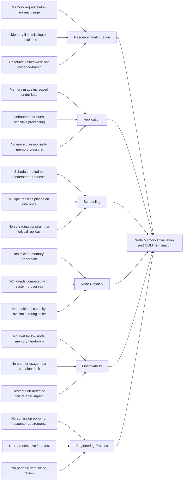

# Case Study 2: Node OOMKill Due to Misconfigured Resource Limits

## Incident Summary

| Field | Detail |
|---|---|
| Incident | Node memory exhaustion and OOM termination |
| Environment | Workhorse development environment |
| Affected component | Kubernetes worker node and application workloads |
| User impact | Intermittent request failures and application pod restarts |
| Detection method | Pod restart alert, Kubernetes events, and memory metrics |
| Severity | Critical |
| Primary cause | Inadequate memory requests and missing or unsuitable memory limits |
| Resolution | Right-sized workload resources and restored node memory headroom |

---

## Technical Context

A container-level `OOMKilled` event and node-level memory pressure are related but distinct conditions:

- A container can be terminated when it exceeds its configured memory limit.
- A node can enter memory pressure when the combined consumption of workloads and system processes approaches its available capacity.
- During node-level memory pressure, the kubelet may evict pods.
- The Linux kernel may terminate processes to recover memory.
- Exit code `137` commonly indicates that a process was terminated using `SIGKILL`.

The investigation must distinguish whether:

1. A container exceeded its configured memory limit.
2. The worker node exhausted its available memory.
3. The kubelet evicted pods because of node memory pressure.
4. Multiple memory-related conditions occurred during the incident.

---

## Symptoms

The incident presented the following symptoms:

- One or more application pods restarted unexpectedly.
- Kubernetes reported `OOMKilled` for an affected container.
- The affected container exited with code `137`.
- A worker node showed sustained high memory utilization.
- The node entered or approached `MemoryPressure`.
- Application requests intermittently failed while containers restarted.
- Ready replicas temporarily dropped below the desired count.
- New pods became difficult to schedule because of insufficient memory.
- Other workloads on the same node experienced increased latency.
- Monitoring detected an increase in pod restarts.
- Logs immediately before termination were incomplete.

### Example Container State

```text
Last State:     Terminated
Reason:         OOMKilled
Exit Code:      137
```

### Example Node Condition

```text
MemoryPressure   True
```

---

## Investigation

### 1. Identify Restarting Pods

Pods with abnormal restart counts were identified:

```bash
kubectl get pods -A \
  -o custom-columns='NAMESPACE:.metadata.namespace,NAME:.metadata.name,RESTARTS:.status.containerStatuses[*].restartCount,STATUS:.status.phase'
```

The affected pod was inspected:

```bash
kubectl describe pod <pod-name> -n <namespace>
```

The `Last State` section was reviewed for:

```text
Reason: OOMKilled
Exit Code: 137
```

---

### 2. Inspect Kubernetes Events

Cluster events were reviewed chronologically:

```bash
kubectl get events -A --sort-by=.metadata.creationTimestamp
```

The investigation looked for:

- `OOMKilling`
- `Evicted`
- `MemoryPressure`
- `FailedScheduling`
- `Killing`
- Readiness probe failures
- Liveness probe failures
- Container restarts

This helped distinguish a container exceeding its limit from wider node-level memory exhaustion.

---

### 3. Check Current Resource Usage

Current pod and node resource usage was reviewed:

```bash
kubectl top pods -A --containers --sort-by=memory
kubectl top nodes
```

Because `kubectl top` only provides current usage, Prometheus was used to examine memory consumption before the restart.

Example working set query:

```promql
sum by (namespace, pod, container) (
  container_memory_working_set_bytes{
    namespace=~"emojivoto-.*",
    container!="",
    image!=""
  }
)
```

Example comparison between memory usage and configured limits:

```promql
sum by (namespace, pod, container) (
  container_memory_working_set_bytes{
    namespace=~"emojivoto-.*",
    container!="",
    image!=""
  }
)
/
sum by (namespace, pod, container) (
  kube_pod_container_resource_limits{
    namespace=~"emojivoto-.*",
    resource="memory",
    unit="byte"
  }
)
```

---

### 4. Inspect Resource Requests and Limits

The effective resource configuration was inspected:

```bash
kubectl get pod <pod-name> -n <namespace> \
  -o jsonpath='{range .spec.containers[*]}{.name}{"\nrequests: "}{.resources.requests}{"\nlimits: "}{.resources.limits}{"\n\n"}{end}'
```

The Git-managed workload contained a configuration similar to:

```yaml
resources:
  requests:
    cpu: 10m
    memory: 32Mi
  limits:
    cpu: 1000m
```

The configuration showed:

- A memory request below the normal working set.
- No enforceable memory limit.
- A CPU limit that did not protect the node from memory growth.
- Scheduling values that did not represent actual workload demand.
- The possibility of multiple memory-consuming replicas being placed on one node.

---

### 5. Inspect Node Conditions

The hosting node was identified:

```bash
kubectl get pod <pod-name> -n <namespace> -o wide
```

The node was inspected:

```bash
kubectl describe node <node-name>
```

The investigation reviewed:

- Allocatable memory
- Requested memory
- Configured memory limits
- Node conditions
- Running pods
- Kubelet events
- Eviction messages
- System-reserved capacity
- Kubernetes-reserved capacity

---

### 6. Review Previous Container Logs

Logs from the terminated container instance were retrieved:

```bash
kubectl logs <pod-name> \
  -n <namespace> \
  --previous
```

The logs were checked for evidence of:

- Increasing queue depth
- Large in-memory operations
- Cache growth
- Unbounded batch processing
- Garbage collection pressure
- Failed shutdown attempts
- Increasing request volume

A missing final application error did not disprove the OOM condition. A forcefully terminated process may not have enough time to write a final log entry.

---

### 7. Compare Configuration With Historical Usage

Historical memory consumption was compared against:

- Configured memory request
- Configured memory limit
- Node allocatable memory
- Number of workload replicas
- Memory used by system workloads
- Normal application consumption
- Peak application consumption
- Expected burst behaviour

The evidence showed that the resource values had not been based on representative workload measurements.

---

### 8. Review Pod Quality of Service

The pod's Kubernetes Quality of Service class was checked:

```bash
kubectl get pod <pod-name> \
  -n <namespace> \
  -o jsonpath='{.status.qosClass}{"\n"}'
```

The investigation considered how missing or mismatched requests and limits affected:

- Scheduling accuracy
- Node overcommitment
- Eviction behaviour
- Resource isolation
- Capacity planning

---

## Root Cause Analysis

### Root Cause Statement

The affected workload was deployed with a memory request below its normal operating requirement and without a suitable memory limit.

Kubernetes scheduled replicas using an unrealistically low declared memory requirement.

During increased workload activity, actual memory consumption grew significantly beyond the requested value. The combined memory usage of workloads on the node exhausted the available memory headroom.

This resulted in node memory pressure and termination of a workload process by the OOM killer.

---

### Contributing Factors

- Memory requests were not based on observed workload usage.
- A memory limit was missing or unsuitable.
- Multiple replicas could be scheduled on the same node.
- No policy prevented workloads without memory requests and limits from being deployed.
- No alert warned when node memory headroom became critically low.
- No alert compared container usage with its configured memory limit.
- The workload had not been tested under representative load.
- The application did not degrade gracefully as memory usage increased.
- Capacity planning considered average usage but not burst behaviour.
- Resource configuration was not periodically reviewed.

---

### Ishikawa Fishbone Diagram



---

### Five Whys

1. **Why did the workload restart?**

   Its process was terminated during an out-of-memory condition.

2. **Why did an out-of-memory condition occur?**

   Workload memory usage consumed the remaining memory capacity on the node.

3. **Why was the workload allowed to consume more memory than expected?**

   It had a missing or unsuitable memory limit, and its declared request understated its normal requirement.

4. **Why did Kubernetes place the workload on that node?**

   The scheduler made its placement decision using resource requests that did not represent the workload's actual memory demand.

5. **Why were the incorrect values not detected before deployment?**

   The platform did not enforce resource policies, validate values against observed usage, or test the workload under representative load.

---

## Fix

### Immediate Stabilization

The affected workload was temporarily scaled or restarted to restore availability while node memory use was reviewed:

```bash
kubectl get deployment -n <namespace>
kubectl rollout status deployment/<deployment-name> -n <namespace>
```

Any emergency command was treated as temporary.

The permanent change was made in the Git repository rather than retained as a manual cluster modification.

---

### Resource Right-Sizing

The workload manifest was updated with explicit resource requests and limits based on observed usage.

Example configuration:

```yaml
resources:
  requests:
    cpu: 50m
    memory: 128Mi
  limits:
    cpu: 500m
    memory: 256Mi
```

> Caution: These values are illustrative. Workhorse resource settings should be calculated from observed baseline, peak, and load-test data.

The memory request was selected to represent a realistic scheduling requirement.

The memory limit provided workload isolation while retaining controlled burst capacity.

---

### Replica Distribution

Topology spread constraints were added where appropriate to reduce the risk of all replicas being concentrated on one node:

```yaml
topologySpreadConstraints:
  - maxSkew: 1
    topologyKey: kubernetes.io/hostname
    whenUnsatisfiable: ScheduleAnyway
    labelSelector:
      matchLabels:
        app.kubernetes.io/name: <application-name>
```

For workloads requiring stronger separation, pod anti-affinity or `DoNotSchedule` can be evaluated alongside the available cluster capacity.

---

### GitOps Deployment

The corrected configuration was:

1. Committed to the repository.
2. Reviewed through a pull request.
3. Rendered and validated in CI.
4. Reconciled by the GitOps controller.
5. Verified against the live Deployment.
6. Tested under controlled load.

No undocumented manual resource patch was retained.

---

### Recovery Validation

The following checks were completed:

```bash
kubectl get pods -n <namespace> -w
kubectl top pods -n <namespace> --containers
kubectl top nodes
kubectl get events -A --sort-by=.metadata.creationTimestamp
```

The deployment was considered recovered when:

- All desired replicas were ready.
- No additional `OOMKilled` events occurred.
- Container memory remained within the expected range.
- Node memory headroom returned to a safe level.
- Application latency returned to normal.
- Application error rate returned to normal.
- The workload remained stable during a controlled load test.
- The live resource configuration matched Git.

---

## Preventions

### Enforce Resource Requirements

All Deployments, StatefulSets, DaemonSets, Jobs, and CronJobs should define:

- CPU requests
- Memory requests
- CPU limits where appropriate
- Memory limits

An admission policy should reject workloads that do not comply with the Workhorse resource standard.

Example policy objectives:

```text
Every application container must define a CPU request.
Every application container must define a memory request.
Every application container must define an approved memory limit.
Resource values must be managed through Git.
```

---

### Establish a Right-Sizing Process

Resource configuration should consider:

- Idle consumption
- Normal operating consumption
- Peak observed consumption
- Load-test consumption
- Runtime overhead
- Replica count
- Node capacity
- Required burst headroom

Recommended review process:

1. Deploy with evidence-based initial values.
2. Observe the workload over a representative period.
3. Compare actual usage with requests and limits.
4. Investigate sustained growth or repeated peaks.
5. Update the configuration through GitOps.
6. Repeat the review after significant application changes.

---

### Improve Memory Alerting

Create alerts for:

- Containers terminated with `OOMKilled`
- Rapid increases in restart counts
- Node `MemoryPressure`
- Low node available memory
- Container memory approaching its configured limit
- Working set consistently above the memory request
- Pods evicted because of memory pressure
- Pending pods caused by insufficient memory

Example OOM alert:

```yaml
- alert: WorkhorseContainerOOMKilled
  expr: |
    increase(
      kube_pod_container_status_restarts_total{
        namespace=~"emojivoto-.*"
      }[10m]
    ) > 0
    and on (namespace, pod, container)
    kube_pod_container_status_last_terminated_reason{
      namespace=~"emojivoto-.*",
      reason="OOMKilled"
    } == 1
  for: 0m
  labels:
    severity: critical
    alert_category: platform
  annotations:
    summary: "A Workhorse container was OOMKilled"
    description: "A container in an emojivoto namespace restarted after an out-of-memory termination."
```

Example node memory headroom alert:

```yaml
- alert: WorkhorseNodeMemoryHeadroomLow
  expr: |
    (
      node_memory_MemAvailable_bytes
      /
      node_memory_MemTotal_bytes
    ) < 0.10
  for: 10m
  labels:
    severity: warning
    alert_category: platform
  annotations:
    summary: "Node memory headroom is below 10 percent"
    description: "A Kubernetes node has had less than 10 percent available memory for 10 minutes."
```

> Note: Metric names, labels, and job selectors must be validated against the Prometheus configuration deployed in Workhorse.

---

### Protect Node Capacity

- Reserve capacity for the operating system and Kubernetes components.
- Avoid scheduling every replica of a critical service on one node.
- Apply topology spread constraints where appropriate.
- Review pod density and aggregate resource requests.
- Maintain sufficient node memory headroom for bursts.
- Test node failure and workload rescheduling.
- Ensure cluster scaling can respond before nodes are exhausted.
- Consider separating observability and application workloads if resource contention becomes a recurring risk.

---

### Application Improvements

- Investigate unbounded caches and queues.
- Use bounded batch sizes.
- Stream large datasets rather than loading them fully into memory.
- Add application-specific memory metrics where available.
- Implement graceful load shedding.
- Validate runtime heap settings against the container memory limit.
- Test application behaviour near its memory boundary.
- Capture memory profiles during controlled load tests.

---

### CI and Policy Controls

Add automated checks that:

- Fail when CPU requests are missing.
- Fail when memory requests are missing.
- Fail when memory limits are missing.
- Detect memory limits below memory requests.
- Flag extreme request-to-limit ratios.
- Render and validate every environment overlay.
- Run admission policy tests against generated manifests.
- Prevent overlays from silently removing resource settings inherited from the base.

---

### Documentation Improvements

Create an OOM troubleshooting runbook containing:

- How to distinguish `OOMKilled` from pod eviction
- How to identify the affected worker node
- How to retrieve previous container logs
- PromQL queries for historical memory usage
- How to compare requests, limits, and working set
- How to verify node memory pressure
- Emergency stabilization options
- GitOps remediation procedures
- Rollback procedures
- Post-recovery validation steps

---

## Lessons Learned

- Memory requests are scheduling inputs, not optional documentation.
- A request below normal usage can cause Kubernetes to overpack a node.
- A missing memory limit can allow one workload to affect unrelated workloads.
- A memory limit that is too low moves the failure to the container boundary.
- Resource values should be based on measurements rather than guesses.
- Current memory usage is insufficient for diagnosis without historical metrics.
- Restart alerts detect the consequence, while memory headroom alerts can detect the developing condition.
- Resource configuration must be reviewed as application behaviour changes.
- GitOps ensures that remediation is repeatable, reviewable, and auditable.

---

# Cross-Incident Improvements

Both incidents identified broader reliability improvements for Workhorse.

## End-to-End Health Validation

Component readiness should be supplemented with outcome-based validation:

- Can applications emit logs?
- Can collectors read those logs?
- Can Loki accept them?
- Can Grafana retrieve them?
- Can workloads remain stable under expected load?
- Can nodes retain safe resource headroom?

---

## Independent Observability Signals

A failure in one observability system should not remove every source of diagnostic evidence.

| Failure | Independent Evidence |
|---|---|
| Loki ingestion outage | Prometheus metrics, Kubernetes events, and collector logs |
| Application OOMKill | Kubernetes status, kube-state-metrics, and node-exporter metrics |
| Prometheus issue | Kubernetes events, application logs, and direct health endpoints |
| Grafana issue | Direct Prometheus and Loki API checks |

---

## GitOps Requirements

All permanent fixes should be:

- Defined declaratively
- Stored in version control
- Reviewed through pull requests
- Validated before merge
- Applied by the GitOps controller
- Verified after reconciliation
- Reversible through Git history

---

## Incident Evidence Checklist

Future Workhorse reliability exercises should capture:

- Alert screenshot
- Grafana dashboard screenshot
- Relevant PromQL or LogQL queries
- Kubernetes event output
- Pod description output
- Previous container logs
- Before-and-after manifest diff
- Git commit containing the fix
- Post-deployment validation output
- Ishikawa fishbone diagram
- Follow-up actions

---

# Conclusion

The Loki ingestion outage demonstrated that healthy components do not necessarily indicate a healthy telemetry pipeline.

End-to-end validation is required to prove that logs are successfully produced, collected, transported, ingested, stored, and queried.

The OOM incident demonstrated that Kubernetes resource requests and limits are core reliability controls.

Inaccurate requests can lead to poor scheduling decisions, while missing or unsuitable limits can allow one workload to destabilize a worker node.

Together, these incidents resulted in improvements to:

- Alerting coverage
- Resource governance
- GitOps validation
- Deployment smoke testing
- Capacity management
- Troubleshooting documentation
- Controlled failure-mode testing

These improvements reduce the probability of recurrence and make similar incidents easier to detect, diagnose, and resolve.