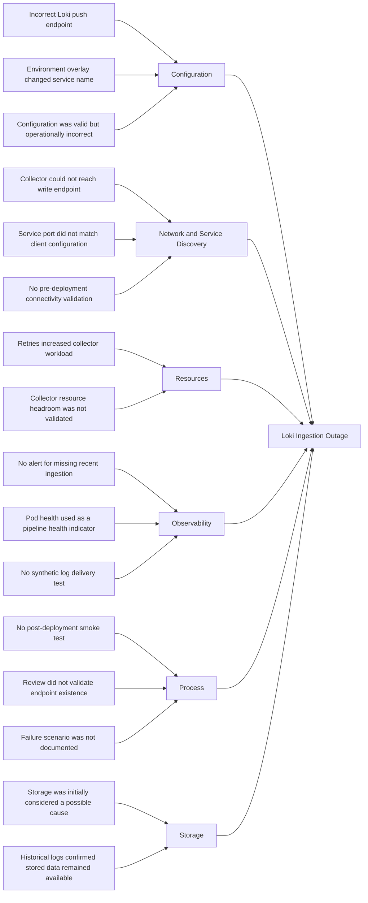
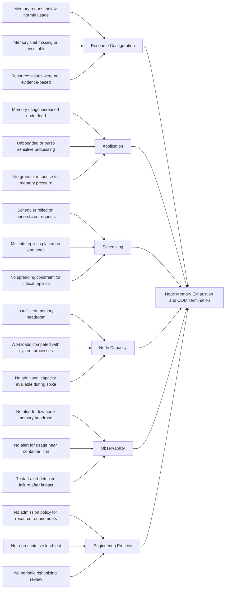

# Case Study 1: Loki Ingestion Outage

## Incident Summary

| Field | Detail |
|---|---|
| Incident | Loki Ingestion Outage |
| Environment | Workhorse development environment |
| Affected component | Loki log ingestion pipeline |
| User impact | Recent application logs were unavailable in Grafana |
| Detection method | Missing log streams and ingestion-related alerts |
| Severity | Warning |
| Data impact | Logs produced during the incident may not have been indexed |
| Resolution | Corrected the Loki ingestion endpoint and validated end-to-end log delivery |

---

## System Context

The Workhorse observability stack uses the following path to collect and query application logs:

```text
Application Pods
      |
      v
Log Collector
      |
      v
Loki Gateway or Distributor
      |
      v
Loki Ingester
      |
      v
Object Storage or Persistent Storage
      |
      v
Grafana
```

A failure involving the log collector, Loki gateway, distributor, ingester, storage backend, or network path can interrupt log ingestion.

---

## Symptoms

The incident presented the following symptoms:

- Grafana queries returned no recent application logs.
- Historical logs remained queryable.
- New log entries stopped appearing for the `emojivoto-*` namespaces.
- Log collector pods reported retries or failed batch submissions.
- Loki components reported an increased number of ingestion errors.
- Application pods remained healthy and continued serving traffic.
- Prometheus metrics remained available.
- Grafana remained accessible, but Loki queries returned incomplete or empty results.
- No application outage was detected outside the logging pipeline.

### Example User-Facing Symptom

```text
No logs found for the selected time range.
```

### Initial Pod Checks

```bash
kubectl get pods -n monitoring
kubectl get pods -n monitoring -l app.kubernetes.io/name=loki
kubectl get pods -A | grep -E "promtail|alloy|fluent-bit"
```

Potential unhealthy states included:

```text
CrashLoopBackOff
Error
Pending
Running with repeated restarts
```

---

## Investigation

### 1. Confirm the Scope

The first step was to determine whether the outage affected:

- A single application
- A single namespace
- One log collector instance
- One Loki component
- All workloads in the cluster
- Only log ingestion
- Both ingestion and querying

Cluster health and recent events were reviewed:

```bash
kubectl get pods -A
kubectl get events -A --sort-by=.metadata.creationTimestamp
```

Several LogQL queries were tested in Grafana:

```logql
{namespace=~"emojivoto-.*"}
```

```logql
{namespace="emojivoto-dev"}
```

```logql
{namespace="monitoring"}
```

Historical logs were available, but newly generated logs were missing.

This indicated an ingestion problem rather than a complete Loki storage or Grafana query failure.

---

### 2. Generate a Known Test Log

A deterministic test log was generated:

```bash
kubectl run loki-ingestion-test \
  --image=busybox:1.36 \
  --restart=Never \
  -n emojivoto-dev \
  -- /bin/sh -c 'echo "WORKHORSE_LOKI_INGESTION_TEST"; sleep 30'
```

The test message was then queried in Grafana:

```logql
{namespace="emojivoto-dev"} |= "WORKHORSE_LOKI_INGESTION_TEST"
```

The test message did not appear.

This confirmed that the ingestion problem could be reproduced independently of the application.

---

### 3. Verify Log Collector Health

The log collector DaemonSet and its pods were inspected:

```bash
kubectl get daemonsets -n monitoring
kubectl get pods -n monitoring -o wide
kubectl describe pod <collector-pod> -n monitoring
kubectl logs <collector-pod> -n monitoring --since=30m
```

The collector logs were checked for:

- HTTP 429 responses
- HTTP 500 responses
- Connection refusals
- DNS resolution failures
- Authentication failures
- Request timeouts
- Batch retry messages
- Permission errors
- Rejected log entries
- Incorrect push endpoints

Example failure messages included:

```text
error sending batch
server returned HTTP status 500
retrying request to Loki
```

---

### 4. Validate Service Discovery

Loki services and endpoints were reviewed:

```bash
kubectl get svc -n monitoring
kubectl get endpoints -n monitoring
kubectl get endpointslices -n monitoring
```

The collector push URL was compared with the active Loki service:

```text
http://<loki-service>.monitoring.svc.cluster.local/loki/api/v1/push
```

DNS resolution was tested from inside the cluster:

```bash
kubectl run dns-test \
  --image=busybox:1.36 \
  --restart=Never \
  -n monitoring \
  -- nslookup <loki-service>.monitoring.svc.cluster.local
```

This test determined whether the collector could resolve the configured Loki service.

---

### 5. Test Network Connectivity

Connectivity to the Loki endpoint was tested from a temporary pod:

```bash
kubectl run curl-test \
  --image=curlimages/curl \
  --restart=Never \
  -n monitoring \
  -- curl -sv http://<loki-service>:<port>/ready
```

This test helped identify:

- DNS failures
- Incorrect service ports
- Missing service endpoints
- NetworkPolicy restrictions
- Loki readiness failures

---

### 6. Inspect Loki Components

The individual Loki workloads were reviewed:

```bash
kubectl get pods -n monitoring -l app.kubernetes.io/name=loki
kubectl logs <loki-pod> -n monitoring --since=30m
kubectl describe pod <loki-pod> -n monitoring
```

The investigation checked for:

- Readiness probe failures
- Storage write failures
- Loki ring membership errors
- Ingester unavailability
- Resource exhaustion
- Repeated pod restarts
- Object storage errors
- Rejected writes
- Configuration parsing errors

---

### 7. Review Recent GitOps Changes

The deployed configuration was compared with the last known-good Git revision:

```bash
git log --oneline --all -- monitoring/
git diff <last-known-good-commit>..<current-commit> -- monitoring/
```

The review focused on changes to:

- Loki service names
- Loki service ports
- Collector push URLs
- Helm values
- Storage configuration
- Resource requests and limits
- NetworkPolicy resources
- Authentication settings
- Kustomize patches
- Environment-specific overlays

The live resources were also inspected:

```bash
kubectl get configmap -n monitoring
kubectl get deployment -n monitoring -o yaml
kubectl get statefulset -n monitoring -o yaml
```

---

### 8. Correlate Metrics With the Failure

Prometheus metrics were used to establish the incident timeline and determine whether Loki was receiving requests but failing to process them.

Relevant signals included:

- Loki ingestion request rate
- Failed ingestion requests
- Rejected log lines
- Distributor errors
- Ingester availability
- Loki pod restarts
- Collector retry rate
- Container memory usage
- Storage request failures

Prometheus provided an independent source of evidence while the centralized logging pipeline was unavailable.

---

## Root Cause Analysis

### Root Cause Statement

A GitOps configuration change introduced an incorrect Loki ingestion endpoint in the development environment overlay.

The log collectors continued reading container logs from the Kubernetes nodes, but they could not successfully deliver log batches to the active Loki write endpoint.

The configuration was syntactically valid, so Kubernetes accepted the deployment. However, the configured service name or port did not correspond to the active Loki write service.

The collectors retried the failed requests, but the monitoring configuration did not provide an early warning that successful ingestion had stopped.

As a result, Grafana displayed historical logs while new log entries were absent.

---

### Contributing Factors

- The collector configuration was syntactically valid.
- The deployment completed despite the endpoint being operationally incorrect.
- The configured service name or port did not match the active Loki write endpoint.
- No automated smoke test validated log delivery after deployment.
- Monitoring checked pod health but not successful data ingestion.
- Grafana availability was treated as an indirect indication of logging health.
- No synthetic log canary verified end-to-end ingestion.
- Environment-specific Loki endpoints were not validated in CI.
- The troubleshooting runbook did not include endpoint validation.

---

### Ishikawa Fishbone Diagram



---

### Five Whys

1. **Why were new logs unavailable in Grafana?**

   Loki was not successfully ingesting new log batches.

2. **Why was Loki not ingesting the batches?**

   The collectors were sending data to an incorrect or unavailable write endpoint.

3. **Why were the collectors using the incorrect endpoint?**

   An environment-specific GitOps configuration changed the Loki service name or port.

4. **Why was the configuration deployed successfully?**

   The configuration was structurally valid, and deployment validation only checked whether the Kubernetes resources became healthy.

5. **Why was the outage not detected immediately?**

   Monitoring checked component availability but did not verify end-to-end log ingestion.

---

## Fix

### Immediate Remediation

The Loki client configuration was corrected so that it referenced the active in-cluster write endpoint.

Example configuration:

```yaml
clients:
  - url: http://loki-gateway.monitoring.svc.cluster.local/loki/api/v1/push
```

> Important: The service name and port must be taken from the Loki services deployed in Workhorse. The example above should not be copied without validating the active Loki deployment topology.

The active service and endpoint were verified:

```bash
kubectl get svc -n monitoring
kubectl get endpoints -n monitoring
```

The corrected configuration was:

1. Added to the appropriate environment overlay.
2. Committed to the Workhorse repository.
3. Reviewed through a pull request.
4. Reconciled by the GitOps controller.
5. Verified against the live cluster.

The log collector pods were then reconciled so that they loaded the corrected configuration.

---

### Recovery Validation

A second deterministic log entry was generated:

```bash
kubectl run loki-recovery-test \
  --image=busybox:1.36 \
  --restart=Never \
  -n emojivoto-dev \
  -- /bin/sh -c 'echo "WORKHORSE_LOKI_RECOVERY_CONFIRMED"; sleep 30'
```

The recovery message was queried in Grafana:

```logql
{namespace="emojivoto-dev"} |= "WORKHORSE_LOKI_RECOVERY_CONFIRMED"
```

Recovery was confirmed when:

- The synthetic test log appeared in Loki.
- Recent application logs became queryable.
- Collector retry errors stopped.
- Loki ingestion errors returned to normal.
- Loki pods remained ready.
- Historical logs remained accessible.
- Prometheus metrics and alerts remained available.
- The deployed configuration matched the Git repository.

---

### Rollback Strategy

If the corrected configuration had not restored ingestion, the change could be reverted:

```bash
git revert <problematic-commit>
git push
```

The GitOps controller would then reconcile the last known-good configuration without requiring an undocumented manual cluster change.

---

## Preventions

### Configuration Controls

- Define Loki endpoints in the common base where possible.
- Limit environment overlays to settings that genuinely differ.
- Validate that referenced services and ports exist.
- Use schema validation for Helm values and rendered manifests.
- Review rendered Kustomize output before merging.
- Prevent direct configuration changes in the cluster.
- Manage all permanent remediation through GitOps.

---

### Automated Validation

Render and validate the final development configuration during CI:

```bash
kubectl kustomize kubernetes/overlays/dev
```

If Helm chart inflation is required:

```bash
kubectl kustomize --enable-helm kubernetes/overlays/dev
```

Add a post-deployment smoke test that:

1. Generates a uniquely identifiable log entry.
2. Queries Loki for the entry.
3. Fails if the entry does not appear within the permitted validation window.
4. Records the result as deployment evidence.

---

### Monitoring Improvements

Create alerts for:

- Sustained Loki ingestion request failures
- Rejected log entries
- Elevated collector retry rates
- Loki component unavailability
- Repeated Loki pod restarts
- Storage write failures
- Unexpected absence of incoming log entries
- Synthetic log canary failures

Example alert structure:

```yaml
- alert: LokiIngestionErrors
  expr: |
    sum(
      rate(loki_request_duration_seconds_count{
        status_code=~"5.."
      }[5m])
    ) > 0
  for: 10m
  labels:
    severity: warning
    alert_category: observability
  annotations:
    summary: "Loki is returning ingestion errors"
    description: "Loki has returned ingestion-related server errors continuously for 10 minutes."
```

> Note: The exact metric names and labels must be validated against the version of Loki deployed in Workhorse.

---

### Operational Improvements

- Create a Loki ingestion outage runbook.
- Document each component in the log delivery path.
- Include known-good LogQL validation queries.
- Record relevant service names and ports for each environment.
- Test logging failures during controlled resilience exercises.
- Ensure Prometheus remains available when Loki is unavailable.
- Monitor successful data flow rather than relying only on pod readiness.
- Include log ingestion validation in deployment acceptance criteria.

---

## Lessons Learned

- A healthy Grafana interface does not prove that logs are being ingested.
- A running collector pod does not prove that log batches are being delivered.
- Component health and end-to-end pipeline health must be monitored separately.
- Observability platforms require independent observability signals.
- Synthetic log delivery provides stronger assurance than pod readiness alone.
- GitOps makes recovery reproducible, but it must be supported by validation and smoke testing.

---

# Case Study 2: Node OOMKill Due to Misconfigured Resource Limits

## Incident Summary

| Field | Detail |
|---|---|
| Incident | Node memory exhaustion and OOM termination |
| Environment | Workhorse development environment |
| Affected component | Kubernetes worker node and application workloads |
| User impact | Intermittent request failures and application pod restarts |
| Detection method | Pod restart alert, Kubernetes events, and memory metrics |
| Severity | Critical |
| Primary cause | Inadequate memory requests and missing or unsuitable memory limits |
| Resolution | Right-sized workload resources and restored node memory headroom |

---

## Technical Context

A container-level `OOMKilled` event and node-level memory pressure are related but distinct conditions:

- A container can be terminated when it exceeds its configured memory limit.
- A node can enter memory pressure when the combined consumption of workloads and system processes approaches its available capacity.
- During node-level memory pressure, the kubelet may evict pods.
- The Linux kernel may terminate processes to recover memory.
- Exit code `137` commonly indicates that a process was terminated using `SIGKILL`.

The investigation must distinguish whether:

1. A container exceeded its configured memory limit.
2. The worker node exhausted its available memory.
3. The kubelet evicted pods because of node memory pressure.
4. Multiple memory-related conditions occurred during the incident.

---

## Symptoms

The incident presented the following symptoms:

- One or more application pods restarted unexpectedly.
- Kubernetes reported `OOMKilled` for an affected container.
- The affected container exited with code `137`.
- A worker node showed sustained high memory utilization.
- The node entered or approached `MemoryPressure`.
- Application requests intermittently failed while containers restarted.
- Ready replicas temporarily dropped below the desired count.
- New pods became difficult to schedule because of insufficient memory.
- Other workloads on the same node experienced increased latency.
- Monitoring detected an increase in pod restarts.
- Logs immediately before termination were incomplete.

### Example Container State

```text
Last State:     Terminated
Reason:         OOMKilled
Exit Code:      137
```

### Example Node Condition

```text
MemoryPressure   True
```

---

## Investigation

### 1. Identify Restarting Pods

Pods with abnormal restart counts were identified:

```bash
kubectl get pods -A \
  -o custom-columns='NAMESPACE:.metadata.namespace,NAME:.metadata.name,RESTARTS:.status.containerStatuses[*].restartCount,STATUS:.status.phase'
```

The affected pod was inspected:

```bash
kubectl describe pod <pod-name> -n <namespace>
```

The `Last State` section was reviewed for:

```text
Reason: OOMKilled
Exit Code: 137
```

---

### 2. Inspect Kubernetes Events

Cluster events were reviewed chronologically:

```bash
kubectl get events -A --sort-by=.metadata.creationTimestamp
```

The investigation looked for:

- `OOMKilling`
- `Evicted`
- `MemoryPressure`
- `FailedScheduling`
- `Killing`
- Readiness probe failures
- Liveness probe failures
- Container restarts

This helped distinguish a container exceeding its limit from wider node-level memory exhaustion.

---

### 3. Check Current Resource Usage

Current pod and node resource usage was reviewed:

```bash
kubectl top pods -A --containers --sort-by=memory
kubectl top nodes
```

Because `kubectl top` only provides current usage, Prometheus was used to examine memory consumption before the restart.

Example working set query:

```promql
sum by (namespace, pod, container) (
  container_memory_working_set_bytes{
    namespace=~"emojivoto-.*",
    container!="",
    image!=""
  }
)
```

Example comparison between memory usage and configured limits:

```promql
sum by (namespace, pod, container) (
  container_memory_working_set_bytes{
    namespace=~"emojivoto-.*",
    container!="",
    image!=""
  }
)
/
sum by (namespace, pod, container) (
  kube_pod_container_resource_limits{
    namespace=~"emojivoto-.*",
    resource="memory",
    unit="byte"
  }
)
```

---

### 4. Inspect Resource Requests and Limits

The effective resource configuration was inspected:

```bash
kubectl get pod <pod-name> -n <namespace> \
  -o jsonpath='{range .spec.containers[*]}{.name}{"\nrequests: "}{.resources.requests}{"\nlimits: "}{.resources.limits}{"\n\n"}{end}'
```

The Git-managed workload contained a configuration similar to:

```yaml
resources:
  requests:
    cpu: 10m
    memory: 32Mi
  limits:
    cpu: 1000m
```

The configuration showed:

- A memory request below the normal working set.
- No enforceable memory limit.
- A CPU limit that did not protect the node from memory growth.
- Scheduling values that did not represent actual workload demand.
- The possibility of multiple memory-consuming replicas being placed on one node.

---

### 5. Inspect Node Conditions

The hosting node was identified:

```bash
kubectl get pod <pod-name> -n <namespace> -o wide
```

The node was inspected:

```bash
kubectl describe node <node-name>
```

The investigation reviewed:

- Allocatable memory
- Requested memory
- Configured memory limits
- Node conditions
- Running pods
- Kubelet events
- Eviction messages
- System-reserved capacity
- Kubernetes-reserved capacity

---

### 6. Review Previous Container Logs

Logs from the terminated container instance were retrieved:

```bash
kubectl logs <pod-name> \
  -n <namespace> \
  --previous
```

The logs were checked for evidence of:

- Increasing queue depth
- Large in-memory operations
- Cache growth
- Unbounded batch processing
- Garbage collection pressure
- Failed shutdown attempts
- Increasing request volume

A missing final application error did not disprove the OOM condition. A forcefully terminated process may not have enough time to write a final log entry.

---

### 7. Compare Configuration With Historical Usage

Historical memory consumption was compared against:

- Configured memory request
- Configured memory limit
- Node allocatable memory
- Number of workload replicas
- Memory used by system workloads
- Normal application consumption
- Peak application consumption
- Expected burst behaviour

The evidence showed that the resource values had not been based on representative workload measurements.

---

### 8. Review Pod Quality of Service

The pod's Kubernetes Quality of Service class was checked:

```bash
kubectl get pod <pod-name> \
  -n <namespace> \
  -o jsonpath='{.status.qosClass}{"\n"}'
```

The investigation considered how missing or mismatched requests and limits affected:

- Scheduling accuracy
- Node overcommitment
- Eviction behaviour
- Resource isolation
- Capacity planning

---

## Root Cause Analysis

### Root Cause Statement

The affected workload was deployed with a memory request below its normal operating requirement and without a suitable memory limit.

Kubernetes scheduled replicas using an unrealistically low declared memory requirement.

During increased workload activity, actual memory consumption grew significantly beyond the requested value. The combined memory usage of workloads on the node exhausted the available memory headroom.

This resulted in node memory pressure and termination of a workload process by the OOM killer.

---

### Contributing Factors

- Memory requests were not based on observed workload usage.
- A memory limit was missing or unsuitable.
- Multiple replicas could be scheduled on the same node.
- No policy prevented workloads without memory requests and limits from being deployed.
- No alert warned when node memory headroom became critically low.
- No alert compared container usage with its configured memory limit.
- The workload had not been tested under representative load.
- The application did not degrade gracefully as memory usage increased.
- Capacity planning considered average usage but not burst behaviour.
- Resource configuration was not periodically reviewed.

---

### Ishikawa Fishbone Diagram



---

### Five Whys

1. **Why did the workload restart?**

   Its process was terminated during an out-of-memory condition.

2. **Why did an out-of-memory condition occur?**

   Workload memory usage consumed the remaining memory capacity on the node.

3. **Why was the workload allowed to consume more memory than expected?**

   It had a missing or unsuitable memory limit, and its declared request understated its normal requirement.

4. **Why did Kubernetes place the workload on that node?**

   The scheduler made its placement decision using resource requests that did not represent the workload's actual memory demand.

5. **Why were the incorrect values not detected before deployment?**

   The platform did not enforce resource policies, validate values against observed usage, or test the workload under representative load.

---

## Fix

### Immediate Stabilization

The affected workload was temporarily scaled or restarted to restore availability while node memory use was reviewed:

```bash
kubectl get deployment -n <namespace>
kubectl rollout status deployment/<deployment-name> -n <namespace>
```

Any emergency command was treated as temporary.

The permanent change was made in the Git repository rather than retained as a manual cluster modification.

---

### Resource Right-Sizing

The workload manifest was updated with explicit resource requests and limits based on observed usage.

Example configuration:

```yaml
resources:
  requests:
    cpu: 50m
    memory: 128Mi
  limits:
    cpu: 500m
    memory: 256Mi
```

> Caution: These values are illustrative. Workhorse resource settings should be calculated from observed baseline, peak, and load-test data.

The memory request was selected to represent a realistic scheduling requirement.

The memory limit provided workload isolation while retaining controlled burst capacity.

---

### Replica Distribution

Topology spread constraints were added where appropriate to reduce the risk of all replicas being concentrated on one node:

```yaml
topologySpreadConstraints:
  - maxSkew: 1
    topologyKey: kubernetes.io/hostname
    whenUnsatisfiable: ScheduleAnyway
    labelSelector:
      matchLabels:
        app.kubernetes.io/name: <application-name>
```

For workloads requiring stronger separation, pod anti-affinity or `DoNotSchedule` can be evaluated alongside the available cluster capacity.

---

### GitOps Deployment

The corrected configuration was:

1. Committed to the repository.
2. Reviewed through a pull request.
3. Rendered and validated in CI.
4. Reconciled by the GitOps controller.
5. Verified against the live Deployment.
6. Tested under controlled load.

No undocumented manual resource patch was retained.

---

### Recovery Validation

The following checks were completed:

```bash
kubectl get pods -n <namespace> -w
kubectl top pods -n <namespace> --containers
kubectl top nodes
kubectl get events -A --sort-by=.metadata.creationTimestamp
```

The deployment was considered recovered when:

- All desired replicas were ready.
- No additional `OOMKilled` events occurred.
- Container memory remained within the expected range.
- Node memory headroom returned to a safe level.
- Application latency returned to normal.
- Application error rate returned to normal.
- The workload remained stable during a controlled load test.
- The live resource configuration matched Git.

---

## Preventions

### Enforce Resource Requirements

All Deployments, StatefulSets, DaemonSets, Jobs, and CronJobs should define:

- CPU 